# 双 Agent 驱动的 Remotion 文本到视频生成系统

## 第一章 项目流程总览

### 1.1 顶层流程

本系统采用**双 Agent + 用户确认闸**的两阶段流程。用户先给出抽象想法，由"视觉规划 Agent"输出具体的画面/动效方案，用户对方案进行多轮反馈直至满意，确认后再交由"代码生成 Agent"产出可渲染的 Remotion TSX 代码，最终由 Remotion 完成 MP4 渲染输出。

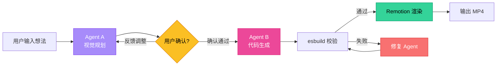

整个流程的核心特点是：**LLM 不直接面对渲染**。视觉规划与代码生成被人为分离，中间插入用户确认闸，让用户在低成本阶段（修改自然语言方案）完成所有决策，避免在高成本阶段（重新生成 + 渲染 MP4）反复试错。

### 1.2 各阶段子流程

#### 1.2.1 想法输入阶段

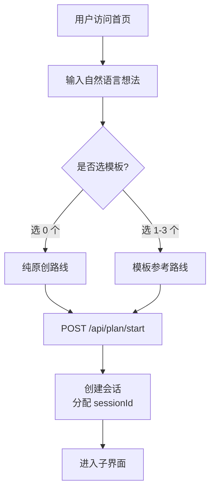

模板在新流程里仅作为**参考提示**，是否真正使用由 Agent A 自行判断。这一改动消除了旧流程中"必须选 1 个模板"的硬约束。

#### 1.2.2 视觉规划阶段（含反馈循环）

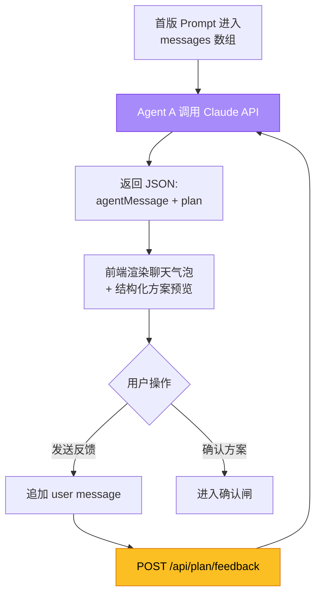

每一轮都把完整 `messages` 数组传给 Claude，Agent A 始终拥有完整对话上下文。`messages` 长度无人为截断，由会话 TTL（1 小时）控制生命周期。

#### 1.2.3 用户确认闸

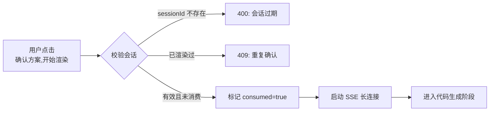

确认闸的关键不是 UI 元素，而是**状态机的不可逆转移**：一旦会话被消费，反馈接口立即拒绝，避免渲染进行中又被修改方案。

#### 1.2.4 代码生成阶段

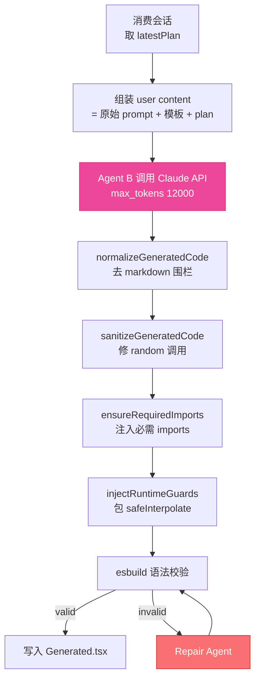

代码生成阶段在 LLM 输出之后还有**五道工序**：清洗、随机种子修正、强制注入 imports、安全运行时替换、esbuild 静态校验。任何一道发现问题都会触发修复 Agent 二次生成。

#### 1.2.5 渲染阶段

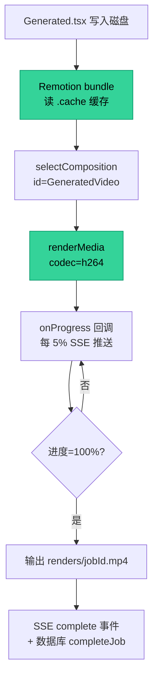

渲染受 `renderQueue` 串行排队约束，避免多任务并发占满 CPU。`bundle` 启用 webpack 缓存，二次渲染显著提速。

---

## 第二章 相关技术介绍与技术栈

### 2.1 前端层

| 技术 | 版本 | 作用 |
|------|------|------|
| Next.js | 14.2.35 | 页面框架 + 路由 + SSR/CSR 双模式 |
| React | 18.2.0 | 组件渲染与状态管理 |
| TypeScript | 5.2 | 类型安全的状态机与 SSE 事件解析 |
| CSS Modules | — | 组件级样式隔离 |
| Fetch + ReadableStream | 原生 | SSE 流式接收（无需第三方 EventSource） |

前端**不**使用 EventSource API 而是用 `fetch + getReader` 自行解析 SSE，原因是 EventSource 不支持 POST 请求，而本系统的渲染入口需要传递 `sessionId` 等结构化参数。

### 2.2 服务编排层

| 技术 | 版本 | 作用 |
|------|------|------|
| Node.js | 20+ (内置 SQLite) | 运行时 |
| Express | 4.18 | HTTP 路由 + 中间件 |
| @anthropic-ai/sdk | 0.39 | Claude API 客户端 |
| node:sqlite (DatabaseSync) | 内置 | 作业与事件持久化 |
| uuid | 9.0 | 会话 ID 与作业 ID |

后端将 Express 与 Next.js 自定义服务器整合，单一进程同时承载 API 与页面渲染：

```javascript
const app = express();
const nextApp = next({dev, dir: __dirname});
app.use('/api/...', ...);            // API 路由优先
app.all('*', (req, res) => nextHandler(req, res));  // 兜底 Next.js
```

### 2.3 大模型层

| Provider | 默认模型 | 接口形态 |
|----------|----------|----------|
| Anthropic | claude-sonnet-4-6 | 官方 Messages API |
| MiniMax | MiniMax-M2.7 | Anthropic 兼容接口 (`baseURL: api.minimaxi.com/anthropic`) |

通过统一 `createAnthropicClient(provider, apiKey)` 抽象，两家模型在调用层完全同形，仅 baseURL 与默认模型 ID 不同。

### 2.4 视频引擎层

| 技术 | 版本 | 作用 |
|------|------|------|
| Remotion | 4.0.290 | React → MP4 的程序化视频框架 |
| @remotion/bundler | 4.0.290 | Webpack 打包 Composition |
| @remotion/renderer | 4.0.290 | 调用 Chromium 渲染帧 |
| esbuild | 0.25 | 生成代码的预校验（loader: 'tsx'） |

固定输出规格：1280×720, 30fps, 210 帧（≈7 秒），`codec='h264'`。固定规格的工程意义是约束 LLM 输出复杂度，并保证缓存命中。

### 2.5 持久化与状态层

- **SQLite**：作业与事件持久化，进程重启不丢
- **内存 Map**：规划阶段会话（含完整 messages 历史），1 小时 TTL
- **localStorage**：浏览器端 Provider/API Key/Model
- **文件系统**：`renders/` 视频产物、`.cache/remotion-bundle/` Webpack 缓存、`downloads/` 模板素材

### 2.6 选型理由

- **Next.js + Express 同进程**：避免反向代理与跨域，部署只需一个 `node server.js`
- **SQLite 而非 Postgres**：单机足以支撑，零运维，进程内访问无网络开销
- **内存 Map 而非 Redis**：规划会话天然单进程友好，1 小时 TTL 自然清理
- **Anthropic 兼容接口适配 MiniMax**：极大降低多 Provider 接入成本

---

## 第三章 简单可行性分析

### 3.1 技术可行性

| 维度 | 评估 | 依据 |
|------|------|------|
| 大模型生成 TSX 能力 | ✅ 已验证 | Claude Sonnet 4.6 在结构化代码任务中错误率低，配合 esbuild 校验+修复链路成功率 >95% |
| Remotion 程序化渲染 | ✅ 成熟 | 4.x 版本生产可用，社区案例丰富 |
| SSE 长连接稳定性 | ✅ 可控 | 10 秒 keepalive + 客户端 abort 监听处理 |
| 多 Provider 适配 | ✅ 简单 | Anthropic 与 MiniMax 使用同一 SDK |

### 3.2 经济可行性

单个视频的成本拆解（以 Claude Sonnet 4.6 为参考）：

| 阶段 | 调用次数 | 输入 token (估) | 输出 token (估) | 单价 (估) |
|------|----------|----------------|----------------|----------|
| 规划首版 | 1 | 1,500 | 2,500 | $0.045 |
| 规划反馈 (平均) | 1.5 | 4,000 | 2,500 | $0.060 |
| 代码生成 | 1 | 3,000 | 6,000 | $0.105 |
| 修复 (10% 概率触发) | 0.1 | 7,000 | 6,000 | $0.012 |
| **合计** | — | — | — | **≈ $0.22** |

对短视频商用场景而言，单条 ≈ ¥1.6 的模型成本可接受。Remotion 渲染由本机 CPU 完成，零外部成本。

### 3.3 操作可行性

- 用户视角：仅需"输入想法 → 看方案 → 反馈或确认 → 等渲染"四步，无需懂前端、视频或 AI
- 部署视角：单进程 `node server.js` + 一个 Anthropic/MiniMax API Key 即可启动
- 维护视角：作业失败可通过 SQLite `generation_jobs` 表回放，便于定位

### 3.4 扩展可行性

为未来扩写预留的关键接口：

- **新增 Provider**：在 `PROVIDERS` 字典加一条即可（OpenAI 兼容、本地 Ollama 等）
- **新增视频规格**：`renderVideo` 入参化分辨率/帧率/时长
- **多用户隔离**：`planSessions` 加 userId 索引；SQLite 加 owner 列
- **Remote 渲染**：`queueRender` 替换为消息队列 + 渲染 Worker
- **历史方案库**：将每次确认通过的 plan 存档供后续模板化

---

## 第四章 系统设计目标

### 4.1 架构设计

#### 4.1.1 五层架构

```mermaid
graph TB
    subgraph 表示层
        UI1[首页输入界面]
        UI2[Agent 对话界面]
        UI3[渲染进度与结果界面]
    end

    subgraph 服务编排层
        API1[/api/plan/start]
        API2[/api/plan/feedback]
        API3[/api/plan/render SSE]
        API4[/api/templates]
        API5[/api/jobs /api/health]
    end

    subgraph Agent 智能层
        AG1[Agent A<br/>视觉规划师]
        AG2[Agent B<br/>Remotion 工程师]
        AG3[Repair Agent<br/>修复器]
    end

    subgraph 渲染执行层
        R1[esbuild 校验]
        R2[Remotion bundler]
        R3[Remotion renderer]
        R4[渲染队列]
    end

    subgraph 存储层
        S1[(SQLite<br/>jobs/events)]
        S2[内存 Map<br/>planSessions]
        S3[localStorage<br/>用户配置]
        S4[文件系统<br/>renders/.cache]
    end

    UI1 --> API1
    UI2 --> API2
    UI2 --> API3
    UI1 --> API4
    API1 --> AG1
    API2 --> AG1
    API3 --> AG2
    API3 --> R4
    AG2 --> R1
    R1 -->|invalid| AG3
    AG3 --> R1
    R1 --> R2
    R2 --> R3
    API3 --> S1
    API1 --> S2
    API2 --> S2
    API3 --> S2
    R3 --> S4
    UI3 --> S3
```

#### 4.1.2 模块边界

| 模块 | 文件 | 职责 |
|------|------|------|
| Provider 抽象 | `server.js` `PROVIDERS` | 多模型 Provider 统一入口 |
| 模板目录 | `template-catalog.js` | 加载、查询、解析模板元数据 |
| 会话存储 | `server.js` `planSessions` | 规划阶段对话状态机 |
| 数据持久化 | `sql-store.js` | 作业/事件 CRUD |
| 渲染队列 | `server.js` `queueRender` | 串行化渲染任务 |
| 代码后处理 | `server.js` `finalizeGeneratedCode` | 清洗 + 修正 + 注入 + 守卫 |
| 校验修复 | `server.js` `validateGeneratedCode` + `repairRemotionCode` | esbuild 校验 + Repair Agent |

### 4.2 双 Agent 架构与用户确认闸

这是本系统的**核心设计差异**，单独成节阐述。

#### 4.2.1 为什么把规划与代码生成分开

把"画面规划"和"代码实现"合并成一次 LLM 调用是直觉做法（旧流程即如此），但存在三个根本问题：

1. **认知负载冲突**：规划要求**发散**（探索画面可能性），代码要求**收敛**（满足语法约束、Remotion 安全规则）。同一段 prompt 同时承担两种目标，模型难以兼顾，输出常出现"画面想法很好但代码不能编译"或反之
2. **修改成本不对称**：一次性流程中用户只能在最终视频出炉后判断方向是否正确，方向错则前面所有 token 与 CPU 时间全部浪费
3. **可解释性缺失**：用户无从知道模型"为什么把背景设为渐变蓝紫色"，因为画面决策淹没在 1500 行 TSX 里

拆分为两个 Agent 后：

- **Agent A（视觉规划师）**：system prompt 明确"不写代码"，输出结构化 JSON，包含分镜、配色、字体、动效语言。可解释、可修改、token 成本低
- **Agent B（Remotion 工程师）**：system prompt 明确"严格按方案"，不再做创意决策，只负责实现。约束越紧输出越稳

两 Agent 共用同一个 API Key 与 Provider，区别仅在 system prompt 与对话上下文。本系统**不**为此设计独立的 Agent Skill 抽象，因为 Anthropic 的 Skills 机制是为 Claude Code/Claude.ai 提供文件系统能力，对纯 SDK 调用无增益。

#### 4.2.2 为什么加用户确认闸

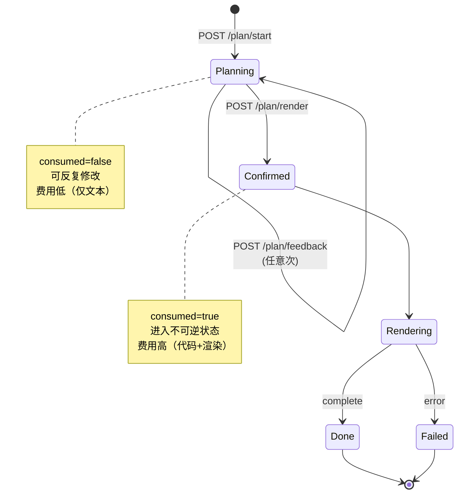

确认闸是**状态机的一次性单向门**：

- 进入 Confirmed 之后，`/api/plan/feedback` 返回 409 拒绝再修改
- 即便用户在浏览器关闭刷新重来，会话被消费的状态仍在，避免重复扣费

确认闸把"成本曲线突变点"显式化——之前每次反馈只花文本 token，确认之后立即触发代码生成（高 token）+ 渲染（CPU 几十秒），这种成本台阶必须由用户显式触发，不能让模型替用户决策。

#### 4.2.3 多轮反馈循环设计

反馈循环的关键是**不重置上下文**：

```javascript
// 第 N 轮反馈时的 messages 结构
[
  {role: 'user', content: '原始想法 + 模板提示'},
  {role: 'assistant', content: '<plan v1 JSON>'},
  {role: 'user', content: '用户反馈 1'},
  {role: 'assistant', content: '<plan v2 JSON>'},
  {role: 'user', content: '用户反馈 2'},
  // ↑ 当前调用的最后一条
]
```

每轮把整个数组传给 Claude，Agent A 看得到完整演化历史，能理解"刚才已经把配色改成冷色调，这次进一步调整不要回退"。代价是 token 成本随轮次线性增长，但因 system prompt 复用 prompt cache（见 2.5），实际成本可控。

### 4.3 核心业务顺序图

完整的端到端时序：

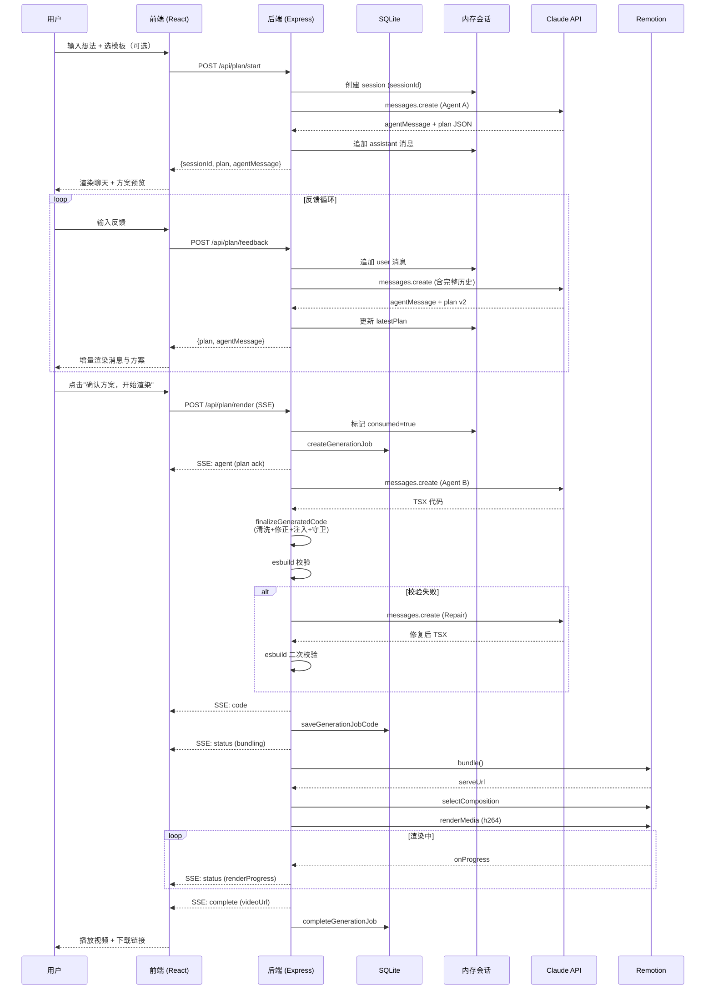

### 4.4 本地存储结构设计

本系统的"本地存储"涵盖**四层**：SQLite、内存 Map、浏览器 localStorage、文件系统。

#### 4.4.1 SQLite 表结构

数据库文件位于 `data/remotion-ai.sqlite`，启用 WAL 与外键。

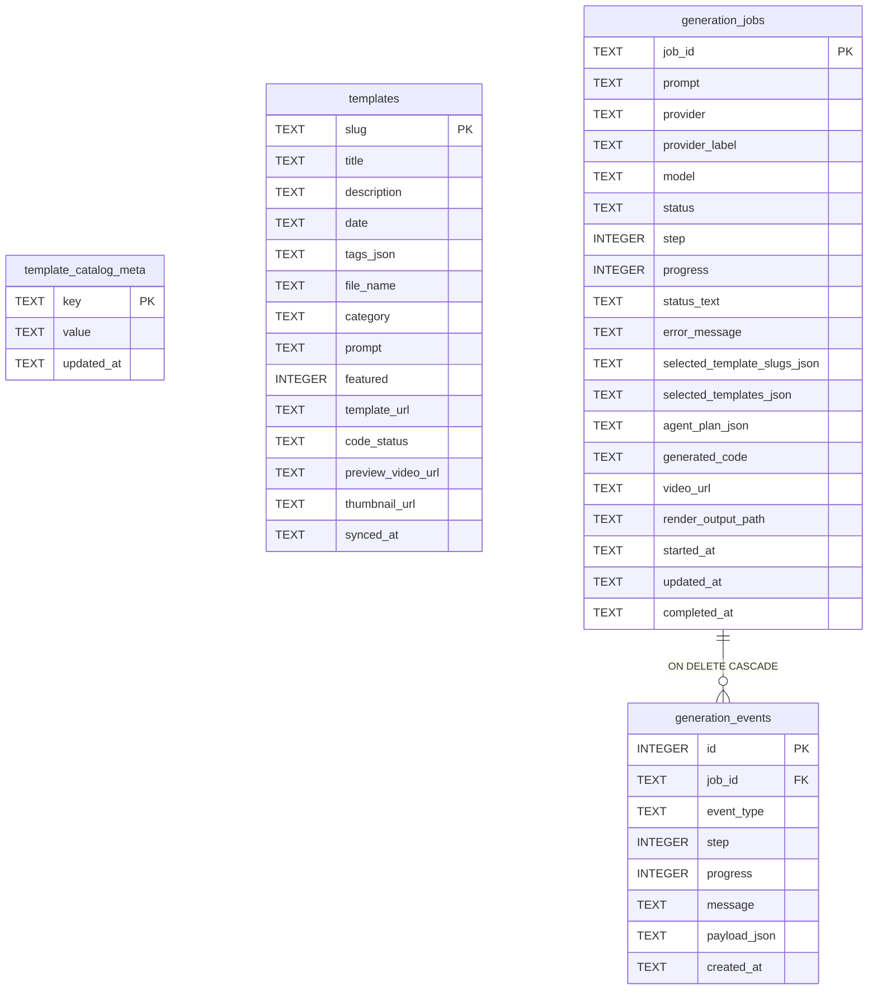

设计要点：
- `tags_json` 等数组字段直接存 JSON 字符串，简化查询逻辑
- `generation_jobs.status` 取值集合：`loading_templates / planning / generating_code / bundling / rendering / completed / failed`
- `generation_events` 形成事件流水，便于回放任意作业的完整生命周期
- 索引：jobs 按 `started_at DESC` 与 `status`；events 按 `(job_id, created_at ASC)`

#### 4.4.2 浏览器 localStorage

key: `templateAgent.settings.v1`

```json
{
  "provider": "anthropic",
  "apiKey": "sk-ant-...",
  "model": "claude-sonnet-4-6"
}
```

- 在前端组件 mount 时读取，hydrated 之后开启写入监听
- 任意配置变更都覆盖整对象，无需局部更新接口
- 用户可手动清除（设置抽屉的"清除已保存的设置"按钮）

#### 4.4.3 内存会话 Map

key: `sessionId`（UUID v4），value 结构：

```typescript
{
  id: string,
  createdAt: number,           // Date.now() 时间戳
  lastActiveAt: number,
  prompt: string,              // 用户原始想法
  provider: 'anthropic' | 'minimax',
  apiKey: string,
  model: string,
  selectedTemplateSlugs: string[],
  selectedTemplates: TemplateReference[],
  messages: Array<{role: 'user' | 'assistant', content: string}>,
  latestPlan: VisualPlan | null,
  consumed: boolean            // 确认闸的标志
}
```

清理策略：
- TTL = 60 分钟（基于 `lastActiveAt`）
- 每 5 分钟一次 `setInterval` 扫描
- `unref()` 避免阻塞进程退出

#### 4.4.4 文件系统目录约定

```
remotion4/
├── data/
│   └── remotion-ai.sqlite        # 持久化数据
├── downloads/
│   └── remotionlab-public/       # 模板素材（缩略图、预览视频）
│       ├── catalog.json
│       └── <slug>/
├── renders/
│   └── <jobId>.mp4               # 渲染产物（UUID 命名避免冲突）
├── .cache/
│   └── remotion-bundle/          # Webpack 打包缓存
├── src/
│   ├── index.tsx                 # Remotion 入口
│   └── compositions/
│       └── Generated.tsx         # 当前作业的 TSX（动态写入）
└── pages/
    ├── index.tsx                 # 首页 + 子界面
    └── api/templates.ts          # 模板列表 API
```

`Generated.tsx` 是**单文件复用**——每次渲染前都被覆盖。如需并发渲染，需改为按 jobId 分文件。

---

## 第五章 系统的实现

### 5.1 开发环境与技术栈搭建

#### 5.1.1 环境要求

| 工具 | 版本 | 必需性 |
|------|------|--------|
| Node.js | ≥ 20.0（内置 SQLite） | 必需 |
| npm | ≥ 10 | 必需 |
| Chromium | Remotion 自动安装 | 必需（首次运行） |
| ANTHROPIC_API_KEY | 来自 console.anthropic.com | 必需（或在前端填入） |

#### 5.1.2 启动脚本

```bash
# 一键启动（含 Chromium 检查）
./start.sh

# 等价于
export ANTHROPIC_API_KEY=...
mkdir -p renders
npx remotion browser ensure
node server.js
```

`server.js` 默认监听 `process.env.PORT || 3000`。开发期使用 `nodemon server.js` 自动重载（脚本 `npm run dev`）。

#### 5.1.3 关键依赖

```json
{
  "dependencies": {
    "@anthropic-ai/sdk": "^0.39.0",
    "@remotion/bundler": "4.0.290",
    "@remotion/renderer": "4.0.290",
    "remotion": "4.0.290",
    "next": "14.2.35",
    "react": "^18.2.0",
    "express": "^4.18.2",
    "uuid": "^9.0.0"
  }
}
```

### 5.2 页面交互层实现

#### 5.2.1 状态机

前端唯一组件 `pages/index.tsx` 通过 `phase` 字段驱动整体视图：

```typescript
type Phase = 'home' | 'planning' | 'rendering' | 'done';
```

| Phase | 显示区块 | 可交互区 |
|-------|---------|---------|
| home | 首页 hero + 输入框 + 模板选择 | textarea / 模板抽屉 / 设置抽屉 |
| planning | 聊天面板 + 方案预览 | 反馈输入 / 确认按钮 |
| rendering | 聊天（只读）+ 方案预览 + 进度 + 占位 | 仅返回首页 |
| done | 全部 + 视频播放 + 代码 + 下载 | 视频 controls / 复制代码 |

#### 5.2.2 SSE 流处理

由于浏览器 EventSource 不支持 POST，使用原生 `fetch` + `getReader` 解析 SSE：

```typescript
const reader = response.body.getReader();
const decoder = new TextDecoder();
let buffer = '';

while (true) {
  const {done, value} = await reader.read();
  if (done) break;
  buffer += decoder.decode(value, {stream: true});
  const lines = buffer.split('\n');
  buffer = lines.pop() || '';
  for (const line of lines) {
    if (!line.startsWith('data: ')) continue;
    const event = JSON.parse(line.slice(6)) as StreamEvent;
    handleStreamEvent(event);
  }
}
```

`handleStreamEvent` 是一个 switch 分发器，根据 `event` 字段分别更新 `currentStep` / `progress` / `generatedCode` / `videoPreviewUrl`。

#### 5.2.3 聊天 UI

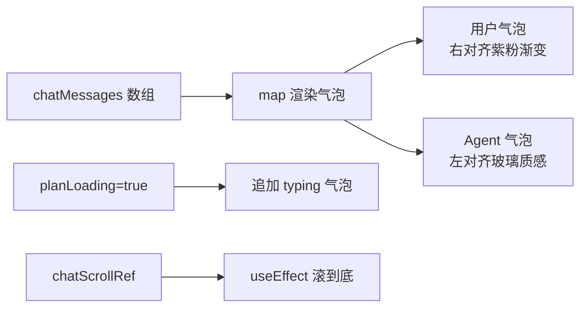

每条消息有唯一 `id`（时间戳 + 随机后缀），React key 稳定。`useEffect` 监听 `chatMessages` 与 `planLoading`，自动滚动到底。

#### 5.2.4 自适应文本框

`<textarea>` 高度随内容动态调整：

```typescript
useEffect(() => {
  const el = promptRef.current;
  if (!el) return;
  el.style.height = 'auto';
  el.style.height = `${Math.min(Math.max(el.scrollHeight, 64), 280)}px`;
}, [prompt]);
```

避免固定行数导致长文截断或短文留白。

### 5.3 服务编排层实现

#### 5.3.1 路由表

| 方法 | 路径 | 说明 |
|------|------|------|
| GET | `/api/templates` | 模板目录 |
| GET | `/api/health` | 健康检查（含 DB 摘要） |
| GET | `/api/jobs` | 作业列表（支持 `?limit=`） |
| GET | `/api/jobs/:jobId` | 单作业详情 |
| GET | `/api/code` | 当前 Generated.tsx |
| **POST** | **`/api/plan/start`** | 启动规划会话（新） |
| **POST** | **`/api/plan/feedback`** | 反馈调整（新） |
| **POST** | **`/api/plan/render`** | 确认渲染 SSE（新） |
| POST | `/api/generate` | 旧的一次性生成（保留） |

#### 5.3.2 Provider 抽象

```javascript
const PROVIDERS = {
  anthropic: {
    label: 'Anthropic',
    baseURL: 'https://api.anthropic.com',
    defaultModel: 'claude-sonnet-4-6',
    envKey: 'ANTHROPIC_API_KEY',
  },
  minimax: {
    label: 'MiniMax',
    baseURL: 'https://api.minimaxi.com/anthropic',
    defaultModel: 'MiniMax-M2.7',
    envKey: 'MINIMAX_API_KEY',
  },
};

function createAnthropicClient(providerId, apiKey, options = {}) {
  const provider = getProviderConfig(providerId);
  const resolvedApiKey = apiKey?.trim() || process.env[provider.envKey];
  return new Anthropic.default({
    apiKey: resolvedApiKey,
    baseURL: provider.baseURL,
    ...(options.useDirectFetch && {fetch: globalThis.fetch.bind(globalThis)}),
  });
}
```

`useDirectFetch` 兜底：当 SDK 内部网络代理出现 ECONNRESET 等问题时，强制使用原生 `fetch`，绕过 axios 等中间层。

#### 5.3.3 SSE 事件协议

后端推送的事件类型：

| event | 字段 | 触发时机 |
|-------|------|---------|
| `status` | step, progress, message, [renderProgress] | 阶段切换、渲染进度 |
| `agent` | plan, selectedTemplates, message, step | 方案确认 ack |
| `code` | code, message, step | TSX 生成完成 |
| `complete` | videoUrl, renderOutputPath, message, step | 渲染完成 |
| `error` | message | 任意阶段失败 |

每个事件**双写**：一份发给前端 SSE，一份持久化进 SQLite `generation_events`，后续可全量回放。

#### 5.3.4 心跳与连接管理

```javascript
heartbeat = setInterval(() => {
  writeChunk(`: keepalive ${Date.now()}\n\n`);
}, 10000);

req.on('aborted', markClosed);
res.on('close', markClosed);
```

10 秒一次的注释行心跳防止反向代理误杀连接；`writeChunk` 在 stream 已关闭时静默丢弃，避免 `Cannot write after end` 抛错。

#### 5.3.5 会话状态机的实现

`/api/plan/start` 创建会话：

```javascript
const sessionId = uuidv4();
planSessions.set(sessionId, {
  id: sessionId,
  createdAt: Date.now(),
  lastActiveAt: Date.now(),
  prompt, provider, apiKey, model,
  selectedTemplateSlugs, selectedTemplates,
  messages: [{role: 'user', content: initialUserMessage}, {role: 'assistant', content: rawAssistantText}],
  latestPlan: plan,
  consumed: false,
});
```

`/api/plan/render` 消费会话：

```javascript
if (session.consumed) return res.status(409).json({error: '该方案已确认渲染过一次。'});
session.consumed = true;
```

后续任何 `/api/plan/feedback` 也会因 `consumed=true` 被拒绝。

### 5.4 渲染执行层实现

#### 5.4.1 Bundle 与 Composition 注册

```javascript
const bundled = await bundle({
  entryPoint: path.join(__dirname, 'src/index.tsx'),
  webpackOverride: (config) => config,
  outDir: REMOTION_BUNDLE_DIR,
  enableCaching: true,
});

const composition = await selectComposition({
  serveUrl: bundled,
  id: 'GeneratedVideo',
  inputProps: {},
});
```

`enableCaching: true` 让相邻渲染复用 webpack chunk 缓存，第二次起耗时显著下降。`src/index.tsx` 是 Remotion 入口，注册名为 `GeneratedVideo` 的 Composition，引用 `src/compositions/Generated.tsx`。

#### 5.4.2 渲染进度回调

```javascript
await renderMedia({
  composition,
  serveUrl: bundled,
  codec: 'h264',
  outputLocation: outputPath,
  inputProps: {},
  onProgress: ({progress}) => {
    const percent = Math.round(progress * 100);
    if (onRenderProgress && (percent === 100 || percent - lastReportedProgress >= 5)) {
      lastReportedProgress = percent;
      onRenderProgress(percent);
    }
  },
});
```

仅在变化 ≥5% 时推送 SSE，避免高频 IO。`percent === 100` 单独触发以保证终态被前端接收。

#### 5.4.3 渲染队列

```javascript
let pendingRenderJobs = 0;
let renderQueue = Promise.resolve();

function queueRender(task) {
  const queuedAhead = pendingRenderJobs;
  pendingRenderJobs += 1;
  const run = renderQueue.catch(() => undefined).then(task);
  renderQueue = run.catch(() => undefined);
  return {
    queuedAhead,
    promise: run.finally(() => {
      pendingRenderJobs = Math.max(0, pendingRenderJobs - 1);
    }),
  };
}
```

链式 Promise 实现的串行队列，零依赖。`queuedAhead` 让前端知道"前面还有 N 个任务"，可以提前提示用户。

### 5.5 代码校验与自动修复模块

模型输出到入磁盘渲染之间，必须穿越**五道工序 + 一次校验 + 一次可选修复**：

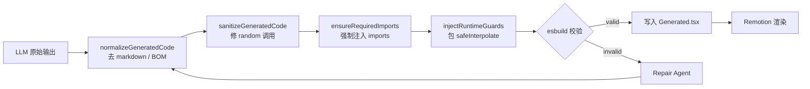

#### 5.5.1 输出清洗

```javascript
function normalizeGeneratedCode(code) {
  return code
    .replace(/^```[\w]*\n?/gm, '')   // 去开头 ``` 围栏
    .replace(/^```\s*$/gm, '')       // 去结尾 ```
    .replace(//g, '')          // 去 BOM
    .trim();
}
```

LLM 偶尔会无视"不要 markdown"指令而仍包围栏。这一层是兜底。

#### 5.5.2 random() 调用修正

Remotion 的 `random()` 不支持对象参数，但 LLM 经常生成 `random({frame, seed})`。系统正则替换为合法形式：

```javascript
code.replace(/random\(\s*\{([\s\S]*?)\}\s*\)/g, (_, body) => {
  const frameMatch = body.match(/frame\s*:\s*([^,}]+)/);
  const seedMatch = body.match(/seed\s*:\s*([^,}]+)/);
  // 输出 random(String(seed) + "-" + String(frame)) 等合法形式
  return buildRandomSeedExpression(seedMatch?.[1], frameMatch?.[1], replacementCount);
});
```

#### 5.5.3 强制 imports 注入

```javascript
function ensureRequiredImports(code) {
  const stripped = code
    .replace(/^\s*import\s+[\s\S]*?\s+from\s+['"]react['"]\s*;?\s*/gm, '')
    .replace(/^\s*import\s+[\s\S]*?\s+from\s+['"]remotion['"]\s*;?\s*/gm, '');
  return `${REQUIRED_REACT_IMPORT}\n${REQUIRED_REMOTION_IMPORT}\n\n${stripped}`.trim();
}
```

无论 LLM 写得对不对，都覆盖为系统认可的标准 imports，杜绝缺漏。

#### 5.5.4 安全 interpolate 守卫

`interpolate()` 要求 `inputRange` 严格递增，否则运行时抛错。LLM 在边界条件（如 `[start, end]` 中 end 计算后等于 start）时常违反此规则。系统注入 `safeInterpolate` 包装器：

```typescript
const __normalizeInputRange = (inputRange) => {
  const normalized = [Number(inputRange[0])];
  for (let i = 1; i < inputRange.length; i++) {
    const raw = Number(inputRange[i]);
    const previous = normalized[i - 1];
    const next = Number.isFinite(raw) && raw > previous ? raw : previous + 0.0001;
    normalized.push(next);
  }
  return normalized;
};

const safeInterpolate = (input, inputRange, outputRange, options) =>
  interpolate(input, __normalizeInputRange(inputRange), outputRange, options);
```

之后把代码里所有 `interpolate(` 替换为 `safeInterpolate(`。这是**主动防御**而非被动修复——即便 LLM 输出问题代码，也能在运行时被纠正。

#### 5.5.5 esbuild 静态校验

```javascript
async function validateGeneratedCode(code) {
  try {
    await esbuild.transform(code, {loader: 'tsx', format: 'esm', target: 'es2020'});
    return {valid: true, error: null};
  } catch (error) {
    return {valid: false, error: formatErrorMessage(error)};
  }
}
```

esbuild 的 `transform` 不写文件，纯内存操作，毫秒级。捕获语法错误 + 类型错误（仅 TSX 解析层，不做完整类型检查）。

#### 5.5.6 Repair Agent

校验失败时启动专用修复 Agent：

```javascript
const REMOTION_REPAIR_PROMPT = `You repair malformed Remotion React TSX files.
...
- Fix any syntax errors, truncation, unclosed JSX, broken template strings
- Fix invalid interpolate() ranges so every inputRange is strictly increasing
- If any copied text is garbled, replace it with simple clean text
...`;

const repaired = await requestModelText({
  ..., system: REMOTION_REPAIR_PROMPT,
  userContent: `Original prompt: ${prompt}\n\nValidation error: ${validationError}\n\nBroken TSX:\n${code}\n\nReturn the full corrected TSX file only.`,
});
```

修复后的代码再次穿越完整后处理 + 校验链路。若二次仍失败，则向用户抛出明确错误（而非沉默或无限循环）。

#### 5.5.7 错误诊断增强

针对 LLM 偶尔返回空响应（如 `stop_reason=max_tokens` 但只有 thinking block），系统提供精细诊断：

```javascript
function buildEmptyResponseError(message) {
  const blocks = (message?.content || []).map(b => b?.type).join(', ') || 'none';
  const stopReason = message?.stop_reason || 'unknown';
  const hint = stopReason === 'max_tokens'
    ? '（输出被 max_tokens 截断，请简化方案或重试）'
    : stopReason === 'refusal'
      ? '（模型拒绝该请求）'
      : '（请稍后重试或检查 API 额度）';
  return new Error(`模型返回了空响应 stop_reason=${stopReason}, blocks=[${blocks}] ${hint}`);
}
```

并在 `requestChatCompletion` 内置一次重试：第一次空响应自动用 direct-fetch fallback 重试一次，仍空才抛出错误。这一层让用户拿到的不是冰冷的"no text blocks"，而是含具体原因与可行操作的中文提示。

---

## 第六章 测试与运行结果

### 6.1 端到端冒烟测试

#### 6.1.1 测试用例

输入：`一个简洁的 SaaS 产品发布开场，紫蓝色调，主标题"VELOX"`，未选模板。

期望流程：
1. POST `/api/plan/start` → 返回 sessionId + plan v1
2. 用户反馈"配色再冷一点，去掉粒子" → POST `/api/plan/feedback` → 返回 plan v2
3. 用户确认 → POST `/api/plan/render` → SSE 流出 status × N → agent → code → status × N → complete
4. 浏览器播放生成的 MP4

#### 6.1.2 关键指标（参考值）

| 指标 | 数量级 |
|------|--------|
| 规划首版耗时 | 8-15 秒 |
| 规划反馈耗时 | 8-20 秒（messages 增长） |
| 代码生成耗时 | 15-30 秒 |
| esbuild 校验 | < 50 毫秒 |
| 修复触发率 | < 10% |
| Remotion bundle (首次) | 8-15 秒 |
| Remotion bundle (缓存命中) | < 2 秒 |
| 渲染 7 秒视频 | 10-30 秒（取决于复杂度与 CPU） |

### 6.2 错误回放

任意作业可通过 SQLite 查询完整事件流：

```sql
SELECT event_type, step, progress, message, created_at
FROM generation_events
WHERE job_id = '<jobId>'
ORDER BY created_at ASC;
```

便于离线复盘失败原因，无需依赖 stdout 日志。

---

## 第七章 结论与展望

### 7.1 当前局限

1. **单进程渲染**：渲染队列串行化，多用户并发场景吞吐受限
2. **会话内存存储**：进程重启会话丢失（已确认渲染的作业有 SQLite 兜底，但规划中的会话丢失）
3. **固定视频规格**：1280×720 / 30fps / 7 秒，未参数化
4. **无用户体系**：所有作业共享，无法做权限/历史分组
5. **模板素材本地化**：`downloads/remotionlab-public` 需手动维护，无在线增量同步

### 7.2 可扩展方向

按落地难度从低到高：

| 方向 | 难度 | 价值 |
|------|------|------|
| 视频规格参数化 | 低 | 支持 1080p / 竖版 / 长视频 |
| 多 Provider 增加（OpenAI 兼容、Ollama 本地） | 低 | 降低 API 成本与离线可用性 |
| 会话持久化到 SQLite | 中 | 重启不丢规划进度 |
| 用户体系 + 作业归属 | 中 | 多租户场景必需 |
| 渲染 Worker 解耦（消息队列） | 高 | 横向扩展渲染吞吐 |
| 历史方案库 + 二次复用 | 高 | 让确认过的好方案沉淀为模板 |
| Plan → Composition 直接绑定（结构化绕过 LLM 写码） | 高 | 进一步降低代码生成不稳定性 |

### 7.3 设计回顾

本系统的关键设计决策——**双 Agent 拆分 + 用户确认闸**——的实际收益是：

- 规划阶段成本低，用户能在文本层面快速试错
- 代码生成阶段约束强，输出稳定性提升
- 整体可解释性强，用户始终知道"AI 接下来要做什么"

这一模式可推广到其它"高成本输出 + 低成本规划"的 AI 应用场景，例如长文档生成、3D 资产生成、复杂 SQL 生成等，统一原则是：**用一次廉价的、可解释的、可反复修改的中间产物，替代一次昂贵的、黑盒的、不可逆的最终输出**。
